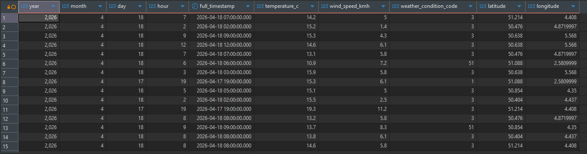

# 🌦️ Pipeline ETL Météo Belgique

Ce projet implémente un pipeline de données complet (**ETL**) pour collecter, stocker et analyser les données météo en temps réel pour 6 villes belges.

**Architecture :** `Airflow (WSL)` ➔ `Amazon S3` ➔ `AWS Glue/Athena` ➔ `DBeaver`

---

## Architecture Technique

**Extraction (Python/Airflow) :** Récupération des données via l'API Open-Meteo.  
**Stockage (AWS S3) :** Persistance des données au format JSON avec un partitionnement optimisé (Hive-style).  
**Catalogue (AWS Glue) :** Définition du schéma et gestion des partitions.  
**Analyse (AWS Athena) :** Requêtage SQL direct sur le Data Lake.  
**Analyse (DBeaver) :** Requêtage SQL direct sur le Data Lake depuis un IDE SQL open source.  

---

## Installation et Configuration

### 1. Environnement Local (WSL / Ubuntu)

Il est important de noter, avant d'aller plus loin, que l'idée de le faire en local est pour limiter la difficulté technique pour un temps réduit. Si j'avais eu plus de temps j'aurais considéré porter le projet sur docker pour avoir une solution plus facilement réplicable.   
La première raison est donc le temps de développement, la deuxième est le coût. Je n'ai pas envie de payer le portage d'un container docker sur airflow de toute façon à mes frais. Mais j'aurais pu faire tourner le container docker en local aussi.  
  

Le projet utilise Airflow 2.10.5 pour garantir la stabilité des composants AWS.

```bash
# Initialisation de l'environnement
mkdir meteo_project && cd meteo_project
python3 -m venv airflow_env
source airflow_env/bin/activate

# Installation d'Airflow
pip install "apache-airflow[amazon,pandas,requests]==2.10.5" \
  --constraint "[https://raw.githubusercontent.com/apache/airflow/constraints-2.10.5/constraints-3.10.txt](https://raw.githubusercontent.com/apache/airflow/constraints-2.10.5/constraints-3.10.txt)"

# Configuration Airflow
export AIRFLOW_HOME=~/airflow
airflow db init

# Créer l'utilisateur admin
airflow users create --username admin --firstname Firstname --lastname Lastname --role Admin --email admin@example.com
```


Nous utilisons des liens symboliques pour séparer le code source du dossier technique d'Airflow.

```bash
mkdir -p ~/meteo_project/dags
ln -s ~/meteo_project/dags/ingestion_meteo.py ~/airflow/dags/ingestion_meteo.py
```

Notre dossier dags pourra donc être sauvegardé sur git, sans que les autres fichiers du repo ne soient dans dans le dossier dags d'Airflow.
Le dossier dags d'airflow pourra donc avoir plusieurs dossiers sources différentes.
  


### 2. Configuration Cloud (AWS)

1. **Création d'un user IAM :**
   - Créez un compte AWS si vous ne l'avez pas déjà.
   - Créez un user IAM avec les permissions nécessaires pour accéder à S3, Glue et Athena.
   - Notez les credentials (access key et secret key).

2. **Connexion Airflow vers AWS :**
    - Dans l'interface Airflow (Admin > Connections), configurer aws_default :
    - Conn Type : Amazon Web Services
    - Login : VOTRE_ACCESS_KEY
    - Password : VOTRE_SECRET_KEY
    - Extra : {"region_name": "eu-central-1"}

3. **Configuration du bucket S3 :**
    - Créer un bucket S3 sur AWS

### 3. Analyse des données (SQL)  

#### Configuration Athena

Exécutez ces commandes dans l'éditeur de requêtes AWS Athena :

```SQL
CREATE DATABASE IF NOT EXISTS weather_db;
```
Cette première entrée permet de créer la base de données si elle n'existe pas encore.

```SQL
CREATE EXTERNAL TABLE IF NOT EXISTS weather_db.weather_data (
    latitude double,
    longitude double,
    current_weather struct<
        temperature: double,
        windspeed: double,
        time: string
    >
)
PARTITIONED BY (year string, month string, day string, hour string)
ROW FORMAT SERDE 'org.openx.data.jsonserde.JsonSerDe'
LOCATION 's3://VOTRE-NOM-DE-BUCKET/weather/';
```
Cette seconde entrée permet de créer la table externe si elle n'existe pas encore. 
La partition à la fin permet d'expliquer la structure de nos données dans l'espace de stockage (qu'on sauvegarde partionné par Années/Mois/Jours.)  
Il faut remplacer la LOCATION par votre bucket S3 créé précédemment.  
Si c'est un nouveau compte AWS ou qu'Athena n'a jamais été utilisé avant, il faut aussi définir un bucket pour les opérations d'Athena, une banderolle bleue devrait vous amener à l'endroit où le faire, vous pouvez créer un S3 spécifique, ou créer une folder dans le S3 précédemment créé. 
  
La ligne ROW FORMAT SERDE 'org.openx.data.jsonserde.JsonSerDe' est spécifique a Hive et Amazon Athena pour lire et écrire des données au format JSON. Nos données étant sauvegardées sous ce format dans le S3.

```SQL
MSCK REPAIR TABLE weather_db.weather_data;
```
Cette entrée permet a Athena qui a maintenant la database et la table, de retourner sur les données et ajouter celles qu'elle peut dedans.

```SQL
SELECT 
    year, month, day, hour, 
    current_weather.temperature AS temp,
    current_weather.windspeed AS vent
FROM weather_db.weather_data
ORDER BY hour DESC
LIMIT 10;
```
Et cette dernière entrée permet de vérifier si vos données sont dedans une fois tout mis en place. 

### Configuration DBeaver

Cette section décrit la procédure pour requêter les données du bucket S3 directement depuis une interface SQL classique (DBeaver).  
Nous avons 3 prérequis à considérer, mais qui sont déjà en place :  
- Access Key & Secret Key : Tes identifiants IAM (les mêmes que pour Airflow).
- Région AWS : Celle de ton bucket (ex: eu-central-1 pour Francfort).
- S3 Output Location : Athena a besoin d'un dossier S3 pour stocker les résultats de tes requêtes SQL.
    - Format attendu : s3://ton-nom-de-bucket/athena-results/ (Crée ce dossier vide dans S3 si besoin).
  
#### Dans DBeaver

1. **Créer une nouvelle connexion :**
Files > New > Dbeaver > Database Connection > Athena
2. **Paramètres principaux :**  
    - Region: Entre le code de ta région (ex: eu-central-1).
    - S3 Output Location: Colle l'URL de ton dossier de résultats (ex: s3://athena-bucket-vincent/results/).
    - Username: Ton Access Key
    - Password: Ta Secret Key
3. **Tester la connexion :**  
Dans mon cas je n'avais pas donné les permissions Athena a mon user. J'ai dû aller modifier les permissions de mon utilisateur dans l'onglet IAM.  
Soit vous aurez une erreur, soit vous allez voir votre base de données apparaitre.  
Une petite requête SQL peut vous permettre de voir vos données et vous assurer que tout est en ordre : 
```SQL 
SELECT * FROM weather_db.weather_data 
ORDER BY year DESC, month DESC, day DESC, hour DESC 
LIMIT 10;
```

Side note intéressante. Ici j'ai compté le nombre de lignes et j'en avais 12. J'ai laissé airflow tourner toute la nuit, et je devais en avoir plus. J'ai relancé le MSCK REPAIR, et j'en avais 84.  
C'était donc la confirmation que Athena n'avait pas l'actualisation des nouveaux folders automatique. J'ai donc ajouté le MSCK REPAIR en fin du dag. C'est une solution provisoire puisque je suppose qu'un setting doit exister dans Athena. A voir laquelle est la moins cher au long terme.

### Création d'une vue 

Une fois nos données disponibles et en place, pour une meilleur visualisation de nos données j'ai créé une vue : 

```SQL 

CREATE OR REPLACE VIEW weather_db.view_weather_metrics AS 
SELECT 
    CAST(year AS INTEGER) as year,
    CAST(month AS INTEGER) as month,
    CAST(day AS INTEGER) as day,
    CAST(hour AS INTEGER) as hour,
    CAST(year || '-' || month || '-' || day || ' ' || hour || ':00:00' AS TIMESTAMP) as full_timestamp,
    current_weather.temperature as temperature_c,
    current_weather.windspeed as wind_speed_kmh,
    current_weather.weathercode as weather_condition_code,
    latitude,
    longitude
FROM weather_db.weather_data;
```
Le résultat obtenu de cette vue est le suivant. 
On voit déjà que les coordonnées sont un plus mais on n'a pas le nom des villes qu'on pourra intuitivement rajouté. 



Donc rien que cette vue peut nous permettre d'en tirer quelque chose sur PowerBI. 
On pourrait considérer que dans ce POC, fusionner les Silver et Gold dans une vue SQL dynamique permet une utilisation plus rapide de PowerBI. Et dans le cas d'un POC au temps limité je devrais m'arrêter à faire ça.  

Le plan A est donc de faire une démo Power BI et présenter ce travail.  
Le soucis que j'ai avec ça est que mon dag n'est pas idempotent. Il tourne sur mon ordinateur qui parfois ne fonctionne pas la nuit, si mon dag met un catchup il prendra juste n fois la température à l'heure du script.  
Il est donc primordial de corriger le DAG pour qu'il puisse récupérer les données du passé.  
Ensuite il serait intéressant de vérifier la cohérence des données, aucun test de data quality n'est implémenté. 
Et dernier point, je n'ai pas d'historisation autre que mon archive (qu'on peut appeler bronze si on veut). Si il y a des soucis par la suite, tous les calculs de nettoyage devraient être refaits, pourraient être différents et nous n'aurions pas d'historisation pour comparer.  
Conclusion, je dois créer une branche pour l'historisation, et ne plus toucher au main tant que la branche n'est pas fonctionnelle. N'hésitez donc pas à vérifier les branches de ce projet, si cette fin de readme est toujours présente c'est que je n'ai pas merge parce que le résultat n'est pas fonctionnel. Le travail fourni n'en sera pas moins intéressant.